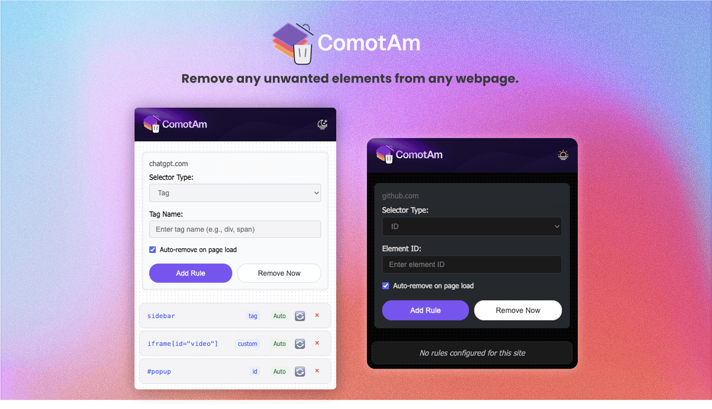

# ComotAm - Element Remover Chrome Extension

A powerful Chrome extension that allows you to remove specific unwanted elements from websites automatically or manually using various selector types. Perfect for customizing website experience, blocking specific elements, removing annoying popups, hiding distracting content, or cleaning up cluttered web pages.

## Features

- **Multiple Selector Types**: Remove elements by ID, class, tag name, or custom CSS selectors
- **Auto-Removal**: Persistent element removal which automatically remove elements when pages load
- **Manual Removal**: Manual removal option for one-time element removal
- **Per-Domain Rules**: Configure different rules for each website (rules are saved per domain and scoped to just that domain)
- **Toggle Control**: Toggle rules between automatic and manual modes
- **Dynamic Content Support**: Handles dynamically loaded content with MutationObserver
- **Instant Feedback**: Real-time status messages and element counts
- **Persistent Storage**: Rules are saved and persist across browser sessions
- **Dark/Light theme**: Supports dark and light mode to fit individual preference
- **User-Friendly Interface**: Easy-to-use interface and straightforward rule management

  

## Installation

### From Source

1. Clone or download this repository
2. Open Chrome and navigate to `chrome://extensions/`
3. Enable "Developer mode" in the top right corner
4. Click "Load unpacked" (in top left corner) and select the extension directory
5. The Element Remover icon should appear in your extensions toolbar

### Required Files

- `manifest.json` - Extension configuration
- `popup.html` - Extension popup interface
- `popup.js` - Popup functionality
- `content.js` - Content script for element removal
- Icon files: `icon16.png`, `icon48.png`, `icon128.png`

## Usage

### Adding Rules

1. **Click the Extension Icon**: Open the Element Remover popup on any website
2. **Choose Selector Type**:
   - **ID**: Target elements by their ID attribute (e.g., `banner`, )
   - **Class**: Target elements by class name (e.g., `popup-banner`)
   - **Tag**: Target elements by HTML tag (e.g., `iframe`, `div`)
   - **Custom CSS Selector**: Use any valid CSS selector (e.g., `iframe[id='video']`, or `div[data-chat="true"]`)
3. **Enter Selector Value**: Input the specific selector without prefixes (# or .)
4. **Set Auto-Remove**: Check to automatically remove elements on page load
5. **Add Rule**: Click "Add Rule" to save the configuration

### Managing Rules

- **View Rules**: All rules for the current domain are displayed in the rules list
- **Manual Removal**: Click the ▶️ button next to manual rules to remove elements immediately
- **Toggle Auto/Manual**: Click the 🔄/⏸️ button to switch between automatic and manual modes
- **Delete Rules**: Click the × button to permanently remove a rule

### Immediate Removal

Use the "Remove Now" button to immediately remove elements matching the current selector input without saving a rule.

## Examples

### Common Use Cases

**Remove YouTube Ads**

- Type: Class
- Value: `video-ads`
- Auto-Remove: ✓

**Hide Cookie Banners**

- Type: Custom CSS Selector
- Value: `[class*="cookie"], [id*="cookie"]`
- Auto-Remove: ✓

**Remove Specific Popup**

- Type: ID
- Value: `newsletter-popup`
- Auto-Remove: ✓

**Hide All Iframes**

- Type: Tag
- Value: `iframe`
- Auto-Remove: ✓

## Technical Details

### Architecture

- **Dynamic Content**: MutationObserver detects new elements added to the page
- **Debounced Operations**: Prevents excessive rule applications
- **Content Script**: Runs only on the active tab to monitor and remove elements
- **Popup Interface**: Provides user interface for managing rules
- **Chrome Storage**: Persists rules using Chrome's local storage API
- **Message Passing**: Communication between popup and content script
- **Error Handling**: Comprehensive error handling with user feedback

### Browser Compatibility

- Chrome Extension Manifest V3
- Requires Chrome 88+ or compatible Chromium browsers

## Permissions

The extension requires these permissions:

- `activeTab`: Access to the current tab for element removal
- `storage`: Save and retrieve rules per domain

## Privacy

- **No Data Collection**: The extension doesn't collect or transmit any user data
- **Local Storage Only**: All rules are stored locally on your device
- **No Network Requests**: Extension operates entirely offline, and makes no network calls.

## Development

### File Structure

```
ComotAm-Element-Remover/
├── manifest.json     # Extension configuration
├── popup.html        # Extension popup interface
├── popup.js          # Popup functionality
├── popup.css         # Styling for the popup
├── content.js        # Content script for element removal
├── package.json      # Project dependencies
├── assets/           # Additional assets
├── icon16.png        # Extension icon (16x16)
├── icon48.png        # Extension icon (48x48)
├── icon128.png       # Extension icon (128x128)
└── README.md         # This file
```

### Building

No build process required - this is a vanilla JavaScript extension.

### Testing

1. Load the extension in developer mode
2. Navigate to test websites
3. Create rules and verify element removal
4. Check console for any errors

## Troubleshooting

### Common Issues

**Elements Not Removing**

- Verify the CSS selector is correct
- Check if elements are loaded dynamically after page load
- Ensure auto-remove is enabled for automatic removal

**Extension Context Errors**

- Reload the extension in `chrome://extensions/`
- These errors are handled gracefully and won't affect functionality

**Rules Not Persisting**

- Check Chrome storage permissions
- Verify the domain is detected correctly

### Debug Mode

Open Chrome DevTools (F12) and check the Console tab for debug messages starting with "Element Remover:".

## Contributing

1. Fork the repository
2. Create a feature branch
3. Make your changes
4. Test thoroughly
5. Submit a pull request

## License

This project is open source and available under the [MIT License](LICENSE).

## Support

For issues, feature requests, or questions:

- Create an issue in the GitHub repository
- Check existing issues for similar problems
- Provide detailed information about your browser and the issue

## Version History

### v1.0.0

- Initial release
- Basic element removal functionality
- Auto-remove and manual modes
- Per-domain rule storage
- Dynamic content support
- Extension context validation
- Light/dark mode

---

### 📍 Let’s Connect

- 🐦 X/Twitter: [@daveyhert](https://x.com/daveyhert)
- 💻 GitHub: [@daveyhert](https://github.com/daveyhert)
- 🌐 Portfolio: [daveyhert.com](https://daveyhert.com)

## ⚠️ Disclaimer

This extension does not block ads, bypass paywalls, or interfere with site monetization or functionality. It is intended solely for personal interface customization on web pages via user-defined CSS selectors.

Use responsibly. Always respect the terms of service of the websites you visit. Some websites may rely on certain elements for essential functionality — removing them could break parts of the site. The extension only operates on pages you actively choose to configure, and it does not collect or transmit any personal or browsing data.

Use responsibly and be aware that removing elements may affect website functionality.

## Acknowledgments

- Inspired by the need for a simple, effective element removal tool
